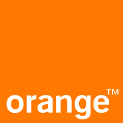

# Les BBLs d'Orange Labs Rennes

Le site d'Orange Labs Rennes fourmille d'experts de domaines variés. Retrouvez la liste des takls que nous serons heureux de donner dans votre entreprise au format "**Brown Bag Lunch**" (BBL)

> Pour plus d'info sur les BBLs et une liste de speakers partout en France : [Brown bag lunch RH France](http://www.brownbaglunch.fr/rh/)

---

## Votre python avance trop lentement ? Venez découvrir comment l'accélérer !
```
#performance #profiling #pythonw
``` 

Python est LENT, tout le monde sait ça ... et pourtant il est utilisé dans des domaines très variés, y compris ceux où la performance compte : machine learning, calcul scientifique, analyse de données et services internet massifs ! Mais comment font-ils ?! Nous verrons comment identifier les portions qui ralentissent réellement votre application, puis les différentes techniques, des plus simples aux plus avancées, pour accélérer votre code python. Keywords: cProfile, yappi, timit, cython, numba, pypy, etc.

> #### Pierre Rust - Architecte logiciel
> 
> 

---

## Comment Elm a changé mon expérience de dev front-end
```
#frontend #programmation_fonctionnelle #no_javascript
```

En passant de Javascript à Elm, mon quotidien a radicalement changé. Les garanties apportées par le compilateur Elm m'apportent une sérénité qui m'était inconnue auparavant. Je n'hésite plus à me lancer dans un refactoring, je n'ai plus de mauvaise surprise en intégrant une nouvelle librairie ou en récupérant le code publié par mes collègues. 'Venez découvrir comment développer des applications front-end sans stress ! 

https://www.youtube.com/watch?v=SLukfn_ucBc, avec présentation du langage, live coding pour montrer l'expérience développeur, et REX sur l'utilisation de Elm sur nos projets

> #### Pascal Le Merrer - Développeur
>
> 


---
## Comment j'ai hacké ma prise électrique
```
#sécurité #hacking #linux #embarqué
```

En 2015, je me suis penché sur l'étude d'une prise électrique connectée qui agit comme passerelle LORA : le porte-clé associé dialogue avec elle pour remonter sa position et des notifications de mouvement.

En cherchant à comprendre son fonctionnement, j'ai rapidement trouvé un certain nombre d'erreurs de conception permettant d'obtenir un accès root sur le Linux embarqué de la prise, et même d'injecter des données corrompues sur le serveur du fabricant. Nous allons parcourir ensemble les étapes permettant de trouver ces erreurs, et surtout en déduire des bonnes pratiques sur les produits que nous développons !

> ### Florent Vuillemin - Développeur Outils Sécurité
>
> 


---
## Du fer à souder à la manette : une console de jeux à partir d'un microcontrolleur
```
#DIY #Electronique
```

Nous verrons comment réaliser une console de jeu avec un puce à partir d'un simple microcontrôleur à quelques euros avec 512k de flash et qq ko de RAM : le principe de codage sur un micro ARM32 bits, la toolchain, génération du signal vidéo TV/VGA, puis peu à peu comment (re)coder des jeux à l'ancienne NES ou en video, émuler des consoles et micro 8 bits (MO5 ! ZX Spectrum, ...), faire de la musique avec un chiptracker, et enfin un système de jeu où tout le jeu est codé dans une seule image ! Des exemples de programmation seront donnés à la fois sur la partie bas niveau et sur le développement de quelques jeux.

> ### Xavier Moulet
>
> 

---

## Electron : Cross platform desktop apps - the Good, the Bad and the Ugly
```
#electron #javascript #html
```

Pourquoi Electron est-il devenu incroyablement populaire pour développer des applications PC/Mac ? Qu'est-ce qui le rend si pratique pour les développeurs ? A quel prix pour les utilisateurs ? Un retour d'expérience sur une application en production depuis 1 an

> #### Jean-François Cunat - Architecte Logiciel
>
> 


---
## FastText
### ou la solution de l'équation x = cidre - bretagne + bourgogne
```
#machine-learning #natural-language-processing
```

Analyse de sentiment, détection de spam, reconnaissance de la langue, ... : toutes ces questions correspondent à un même problème de « **classification** ». Un développeur lambda utiliserait naturellement des **expressions régulières** ou du **pattern matching** pour en venir à bout. Mais grâce à la démocratisation du **machine learning**, il est désormais possible de le résoudre en utilisant des algorithmes d'apprentissage automatique performants, sans même s'en rendre compte !
Dans ce talk, nous allons vous permettre d'ajouter une corde à votre arc de développeur en vous présentant la librairie **FastText**.
Après une introduction sur les questions de classification et le monde étonnamment fascinant du traitement automatique de la langue, nous répondrons à la question existentielle :

```python
Que vaut "cidre - bretagne + bourgogne" ?
```

Ensuite, nous construirons **en live**, « from scratch », un système qui classe automatiquement une question posée sur stackoverflow et un autre qui detecte automatiquement la langue dans laquelle est rédigée un texte.

> #### Fabrice Depaulis - Développeur Data-Search
>
> 
